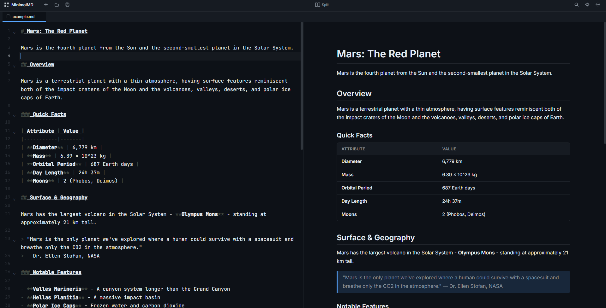
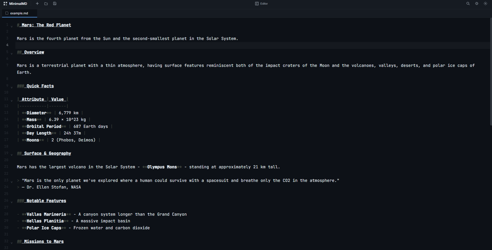
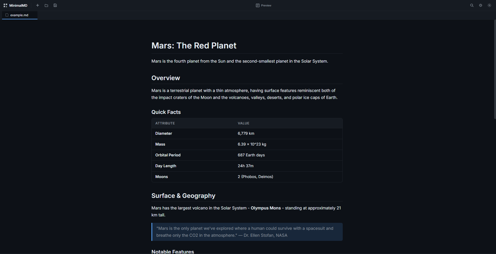
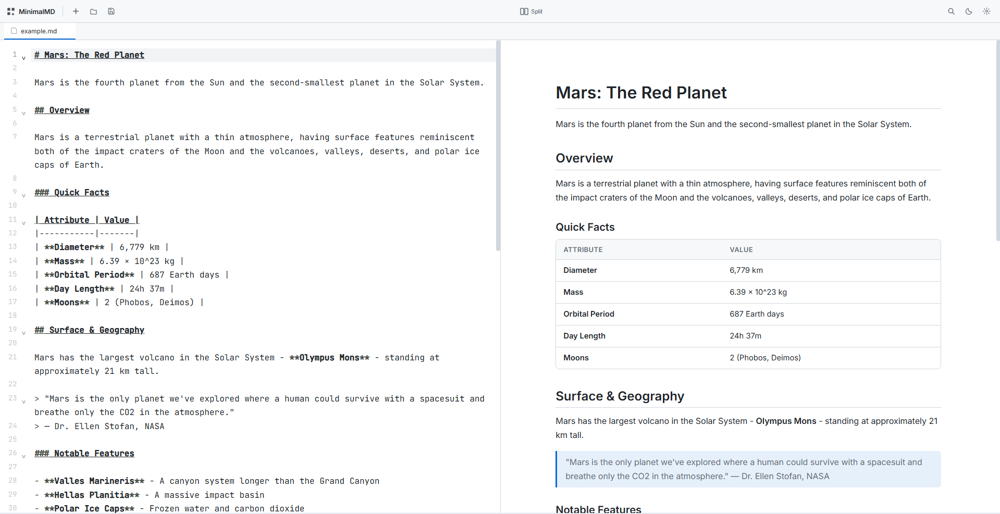
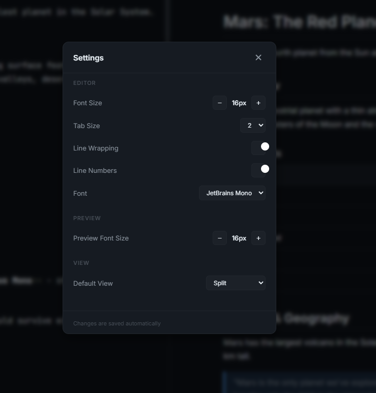

# MinimalMD

A clean, lightweight Markdown file viewer and editor built with Tauri + React. Open, edit, and preview your `.md` files with ease.



## Features

- **View & Edit** - Switch between editor and preview modes
- **Syntax Highlighting** - Code blocks are beautifully highlighted with support for 100+ languages
- **Live Preview** - See your formatted Markdown in real-time
- **Light & Dark Mode** - Work comfortably in any lighting condition
- **GFM Support** - GitHub Flavored Markdown, tables, task lists, and more
- **Open Files** - Open any `.md` file from your computer
- **Save Files** - Save your changes back to disk

## Screenshots

### Editor View


### Preview View


### Light Mode


### Settings


## Quick Start

### Prerequisites

- [Node.js](https://nodejs.org/) (v18+)
- [Rust](https://rustup.rs/) (latest stable)

### Installation

```bash
# Clone the repository
git clone https://github.com/Simangka/MiniMD.git
cd MiniMD

# Install dependencies
npm install

# Run in development mode
npm run tauri dev

# Build for production
npm run tauri build
```

### Running the App

After building, find your executable at:
- **Windows**: `src-tauri/target/release/MinimalMD.exe`
- **macOS**: `src-tauri/target/release/bundle/macos/MiniMD.app`
- **Linux**: `src-tauri/target/release/minimalmd`

## How to Use

1. **Open a file**: Click the folder icon or use the File menu to open any `.md` file
2. **Edit**: Type in the editor on the left side
3. **Preview**: Click the eye icon to switch to preview mode
4. **Toggle theme**: Use the sun/moon icon to switch between light and dark mode
5. **Save**: Click the save icon or Ctrl+S to save your changes

## Example Files

Check out the `Example_md` folder for a sample Markdown file demonstrating various features including tables, code blocks, math, and more.

## Why MiniMD?

- **No cloud required** - Your files stay on your machine
- **No account needed** - Just open and go
- **Fast & lightweight** - Built with modern tech for speed
- **Perfect for**:
  - Writing documentation
  - Creating AI prompts & skills
  - Note-taking
  - Coding notes
  - Any Markdown content

## Tech Stack

- **Frontend**: React + Vite
- **Backend**: Tauri (Rust)
- **Editor**: CodeMirror 6
- **Markdown**: react-markdown + remark-gfm

---

Made with ❤️ by [Simangka](https://github.com/Simangka)
